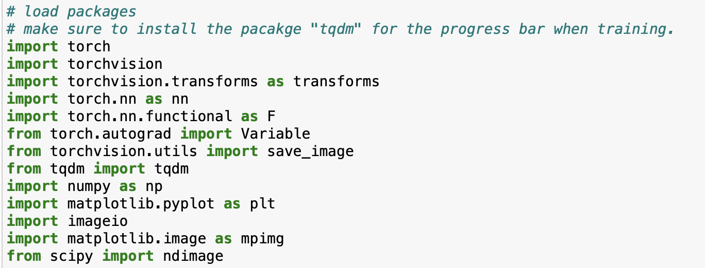

Autoencoder
==========

## Autoencoder using Pytorch Library 

The autoencoder is a kind of neural network that has two components: 
1. An encoder function f(x) that converts input's x to bottleneck feature representation z 
  > z = f(x)
  which have lower dimensions than the input.
2. A decoder function g(x) that produces a reconstruction of the inputs as y from the bottleneck feature representation z.
  > y = g(z)

The overall neural network is g*f , which takes an input x and produces a reconstruction y. 

Mathematically,
  >y = g( f (x))

In the simplest case, both f and g are multi-layer perceptrons (MLPs); in this case, the overall
neural network, g * f , is an MLP as well. The primary difference between a typical MLP and
an autoencoder is that an autoencoder is unsupervised, that is, it can be trained without labels.
It can be used to generate new data by manipulating the bottleneck feature representation z. 
The objective function we use to train the autoencoder is the same as that of multi-output nonlinear regression, 
namely squared L2 loss between the reconstruction y and the input x.

## Dataset

We are using MNIST image dataset which is obtained using the autoencoder_starter.py file. 
No need to include any data, when we run the code for the first time it will autodownload 
the MNIST dataset as required from Tensorflow library inside a newly created directory Autodownload_Data.
I am not including this directory in master as once you run the code it will auto create on your local system in same
location where we save all the files. 

To modify and train the model and make more dense model, it is recommended to use Google collab as it will allow GPU
for training because as we increase the hidden layers, the trianing time wil drastically increase for the Model. 

## Workflow

**1. Importing the required libraries.** 
 
  
 
**2. Training a simple autoencoder without any hidden layer and 2D bottleneck feature.**
 

 
**3. Generating a scatter plot of bottleneck features.**
 

 
**4. Training a new Model with 1024 neurons in 1 hidden layer with 2D bottleneck feature.**
 

 
**5. Generating the scatter plot and comapre both scatter plots.**
 

 
**6. Generated new random images from bottleneck features from new Model.**
 

 
**7. Printing first 64 Origional images and reconstructed images to compare how model is working.**
 

 
**8. Interpolation between 2 random images is generated for the Model.**
 

 
**9. Training a new Model with same architecture as above but with 10D bottleneck features.**
 

 
**10. Generating Interpolated images of same images as above and compare both interpolation difference.**
 

 
**11. Reconstructed first 64 images again with this model to compare with earlier version.**
 

 

